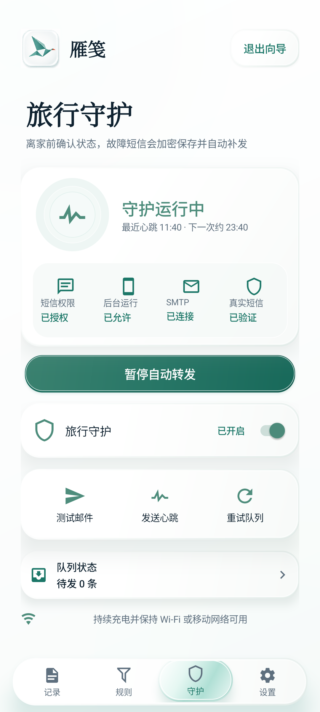
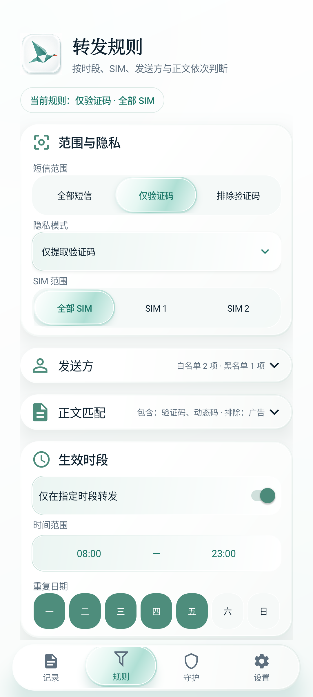
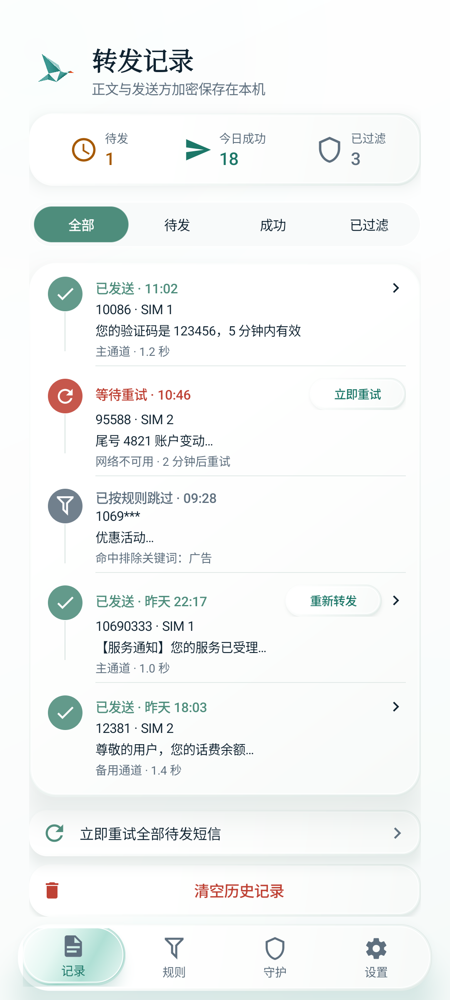
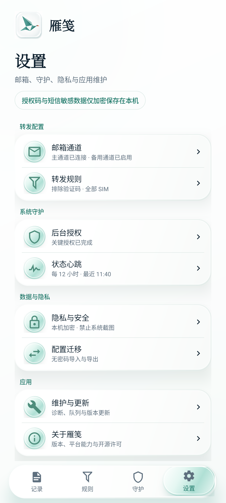
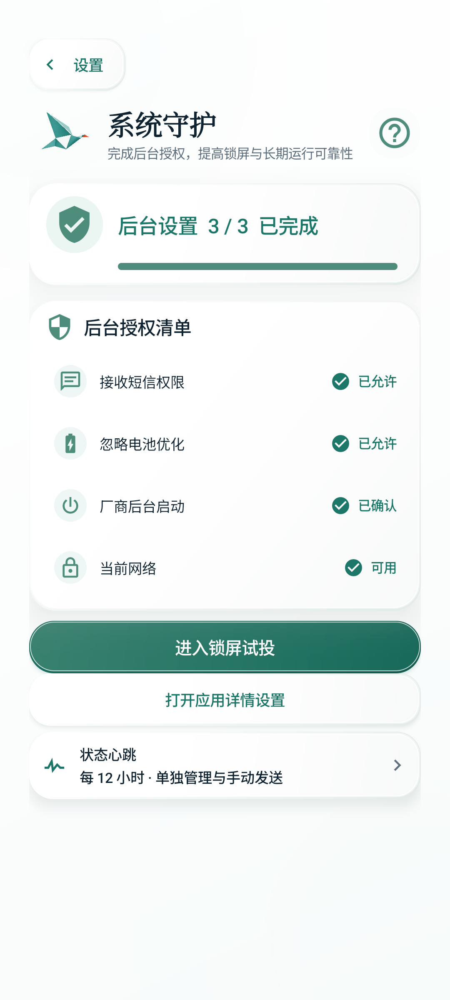
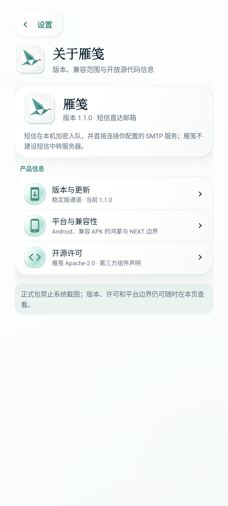
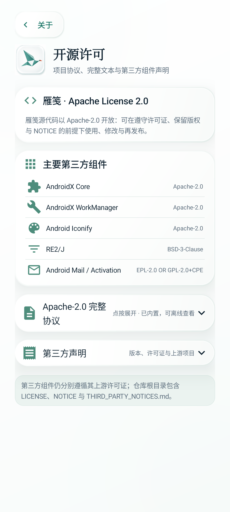

# 雁笺（Yanjian）

[](https://github.com/mikutea/sms-to-email-forwarder/actions/workflows/android.yml)
[](https://github.com/mikutea/sms-to-email-forwarder/releases/latest)
[](LICENSE)

雁笺是一款面向自有 Android / 鸿蒙 2–4 设备的短信转邮箱应用。新短信在手机本地进入加密队列，再直连用户自己的 SMTP 服务；不需要第三方中继服务器、Root、无障碍或通知读取权限。

> 当前稳定版：`v1.1.0`。正式版与 Beta 使用同一签名，可覆盖安装并保留本机配置。厂商启动管理不存在普通 App 可统一弹出的标准授权框，雁笺会打开设备可用的系统入口，并在返回后立即确认结果。

[下载最新稳定版 APK](https://github.com/mikutea/sms-to-email-forwarder/releases/latest/download/yanjian-v1.1.0.apk) · [查看发布说明](docs/release-notes/1.1.0.md) · [安装与后台设置](docs/harmonyos-4-install.md)

## 应用截图

以下截图来自 Android 15 / API 35 隔离虚拟设备，仅使用合成短信、示例邮箱和模拟状态。

<p align="center">
  
  
  
  
</p>

<p align="center">
  
  
  
  
</p>

## 核心能力

- 接收新短信后调度秒级发送，不读取历史短信；支持多段长短信合并和双卡卡槽规则。
- 邮件同时提供移动端友好的 HTML 主视图和纯文本兼容视图，显示发送方、SIM、接收时间、正文与投递编号。
- AES-GCM 加密本机待发队列与历史记录；稳定消息 ID、并发租约、指数退避、容量上限和断网恢复。
- 主/备用 SMTP、多个收件人，以及主通道、失败切换、双通道三种投递策略。
- 仅允许 SMTP over TLS 或强制 STARTTLS，并保持服务器证书主机名校验。
- 发送方白名单/黑名单、关键词、线性时间正则、验证码、时段、星期和正文脱敏规则。
- 旅行守护：真实短信闭环门槛、后台授权引导、6/12/24 小时心跳、低电量与断电提醒。
- 加密历史、失败重发、队列清理、规则预览、无密码配置导入导出和脱敏诊断报告。
- 稳定版 / Beta 更新通道和应用内下载；安装前校验资产摘要、包名、版本代码与签名证书，最终覆盖安装由系统和用户确认。
- “月白青玉”视觉：统一折纸飞雁图标、软拟态内容层、玻璃一级导航和遵循系统“减少动画”设置的短动画。

## 平台支持边界

| 平台 | 自动读取新短信 | 客户端形态 | 当前状态 |
| --- | --- | --- | --- |
| Android 6.0（API 23）及以上 | 支持 | APK | `v1.1.0` |
| 保留 Android APK 兼容能力的 HarmonyOS 设备 | 支持 | 与 Android 共用 APK | 需要按设备和系统版本完成真机验证 |
| HarmonyOS NEXT | 普通三方应用无公开短信读取能力 | 原生 HAP 只能承担配置、状态等伴随功能 | 不宣称支持自动短信转发 |

HarmonyOS NEXT 若要完整接入，需要把短信入口迁移到运营商网关、独立蜂窝短信设备，或继续由 Android / 鸿蒙 2–4 设备接收。项目不会使用无障碍模拟点击、通知偷读或私有 API 冒充 NEXT 支持。

## 工作原理

```text
SIM 新短信
  -> Android / HarmonyOS 2–4 系统短信广播
  -> 雁笺本机 AES-GCM 加密队列
  -> WorkManager 受约束发送与退避重试
  -> 用户自己的 TLS SMTP 服务
  -> 一个或多个收件邮箱
```

直连 SMTP 能去掉第三方服务器，但不能保证严格 exactly-once：若服务器已经接收邮件、手机却在收到成功响应前断网，重试可能产生重复邮件。强制停止、关机、重启后尚未首次解锁、SIM 无服务和邮件服务商延迟也超出普通 App 的控制范围。

## 快速开始

1. 安装正式版 APK，在“设置 → 邮箱通道”填写 SMTP 主机、端口、用户名、授权码、发件与收件邮箱。
2. 发送 SMTP 测试邮件；不要把网页登录密码当作授权码。
3. 确认短信外发隐私风险，启用自动转发并授予接收短信权限。
4. 在“设置 → 后台授权”完成短信、忽略电池优化和厂商启动管理；返回雁笺后确认一次厂商设置。
5. 进入“锁屏试投”，用一条真实短信完成亮屏、锁屏、Wi-Fi、移动网络和断网补发验收。
6. 所有离家条件均通过后，再开启旅行守护。

详见 [SMTP 配置与安全](docs/smtp-configuration.md)、[旅行守护验收](docs/travel-mode.md)、[隐私与安全](docs/privacy-and-security.md) 和 [平台支持边界](docs/platform-support.md)。

## 开源许可

雁笺使用 [Apache License 2.0](LICENSE) 发布，并提供 [NOTICE](NOTICE) 与 [第三方组件声明](THIRD_PARTY_NOTICES.md)。应用内可通过“设置 → 关于雁笺 → 开源许可”离线查看项目协议全文和运行时组件清单。

## 开发与构建

Android 客户端位于 `clients/android/`，使用 JDK 17、Gradle Wrapper 8.9、Android SDK Platform 35：

```powershell
cd clients/android
.\gradlew.bat --no-daemon testDebugUnitTest lintDebug assembleDebug assembleRelease
```

项目使用 GitHub Flow：从 `main` 创建功能分支，本地验证后提交 Pull Request，由 GitHub Actions 在同一提交上复验，再审查和合并。正式 Release APK 使用项目专用签名密钥；密钥和密码不得进入仓库。

## 仓库结构

- `clients/android/`：Android 与 HarmonyOS 2/3/4 兼容客户端。
- `docs/`：安装、SMTP、旅行守护、隐私安全、设计审计与发布说明。
- `.github/workflows/`：单元测试、Lint、APK 构建与签名发布。

版本变化见 [CHANGELOG.md](CHANGELOG.md)，正式签名与验证见 [发布流程](docs/release-process.md)，安全边界与报告方式见 [SECURITY.md](SECURITY.md)。本项目仅用于设备所有者明确授权的短信；部署者负责遵守适用的隐私、通信和数据保护要求。
