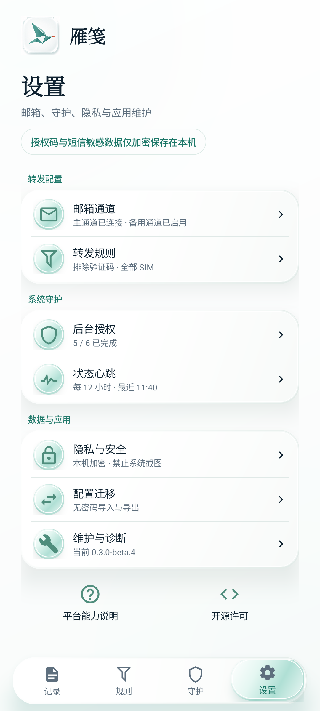
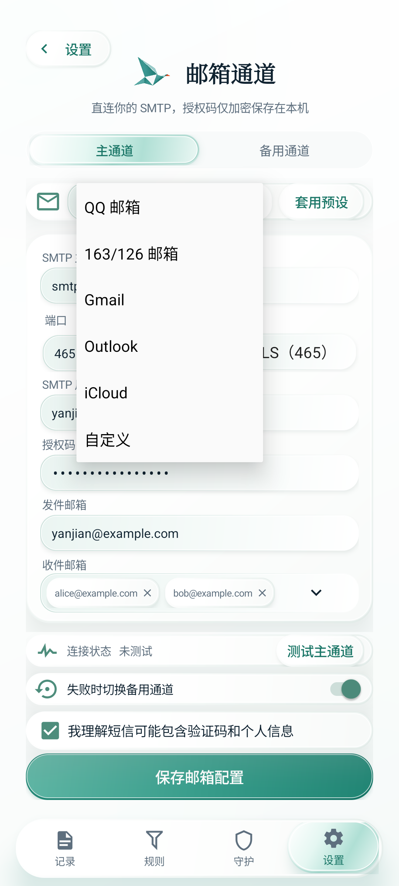
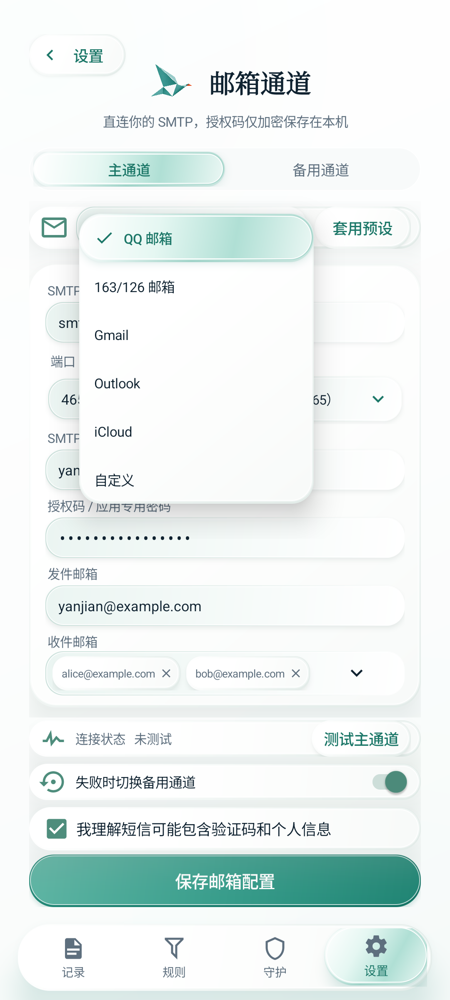
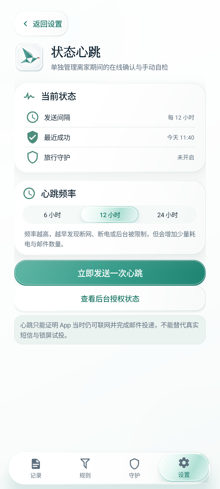
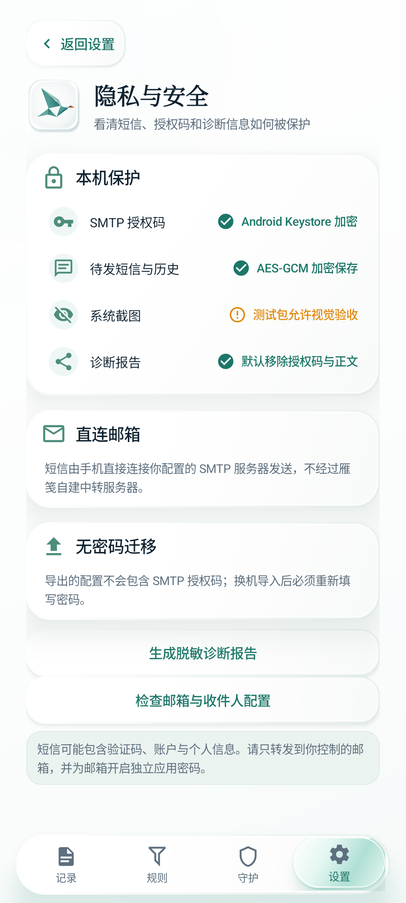
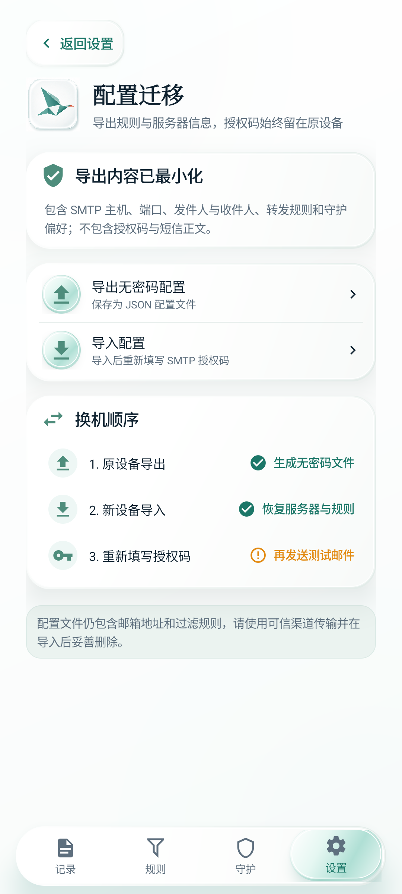
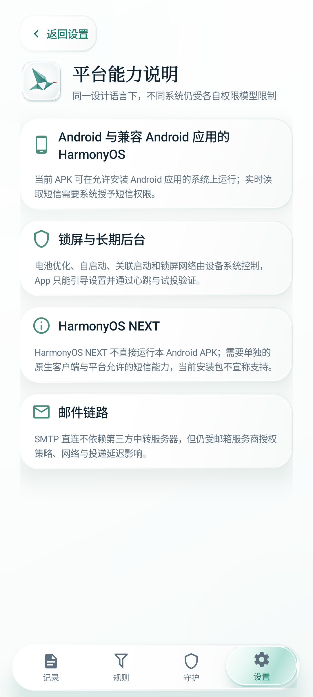
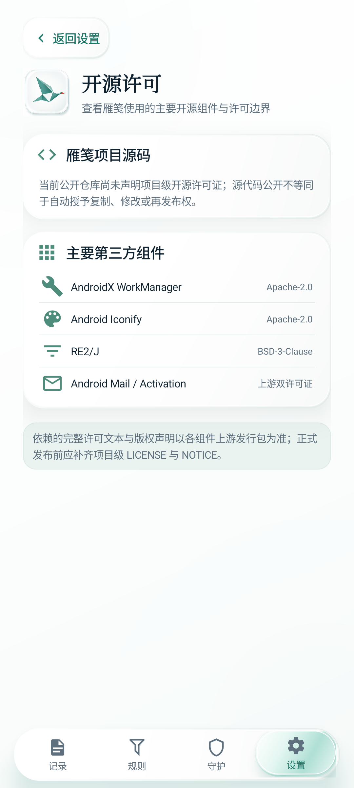

# 设置路由与下拉组件审计

## 审计范围

- 产品表面：Android 原生客户端 `0.3.0-beta.4` 设置总览、邮箱通道与设置子页。
- 用户目标：点击一个功能入口时进入与标题一致的页面，并在所有表单中看到一致、可辨识的下拉选择体验。
- 捕获环境：Android 15 / API 35、1080 × 2400、420 dpi 浅色虚拟设备；所有画面使用合成数据。

## 结论

修复前，九个设置入口实际只落到四类页面；状态心跳与后台授权共用系统守护页，隐私、配置迁移、维护、平台能力和许可大量复用维护页。原生 `Spinner` 的弹层则回退为系统白色直角列表，缺少青玉选中态和当前值提示。

修复后九个入口使用九个不同目的地，维护页不再承担迁移职责；下拉框统一使用圆角玻璃弹层、48 dp 选项高度、选中勾选、青玉高亮和展开箭头。

## 证据

### 1. 设置总览

健康度：良好。分组、标题与九个入口保持原定稿结构，修改集中在点击目的地，不改变用户已经确认的视觉层级。

### 2. 下拉组件修复前

健康度：需修复。系统默认白色列表与月白青玉玻璃组件断裂，当前选中项也没有品牌化状态。

### 3. 下拉组件修复后

健康度：良好。弹层、选中胶囊、勾选图标、圆角和阴影已与页面其他玻璃操作统一。

### 4. 状态心跳

健康度：良好。频率、最近成功、手动心跳与后台授权入口集中在独立页面。

### 5. 隐私与安全

健康度：良好。加密范围、截图策略、直连邮件和无密码迁移均有明确说明；Debug 截图能力没有伪装成正式包状态。

### 6. 配置迁移

健康度：良好。导入与导出操作从维护页移出，并明确提示授权码不随配置文件迁移。

### 7. 平台能力说明

健康度：良好。Android 兼容系统、锁屏后台、HarmonyOS NEXT 与 SMTP 边界分别说明，不再与诊断操作混排。

### 8. 开源许可

健康度：良好。项目级许可缺失和主要第三方组件被如实分开呈现，避免把“仓库公开”等同于已授权再发布。

## 路由验收

| 设置入口 | 目标页面 |
| --- | --- |
| 邮箱通道 | 邮箱通道 |
| 转发规则 | 转发规则 |
| 后台授权 | 系统守护 |
| 状态心跳 | 状态心跳 |
| 隐私与安全 | 隐私与安全 |
| 配置迁移 | 配置迁移 |
| 维护与诊断 | 维护与诊断 |
| 平台能力说明 | 平台能力说明 |
| 开源许可 | 开源许可 |

## 可访问性与证据限制

- 下拉选项保留至少 48 dp 高度，选中状态不只依赖颜色，并提供“当前选择 / 选择 / 已选择”的辅助功能描述。
- 所有新增子页可滚动，返回设置和底部设置导航保持可达。
- 截图可以验证布局、状态表达和触控尺寸，不能单独证明完整读屏顺序或真机动画性能；这些仍需 TalkBack 与真机验收。
