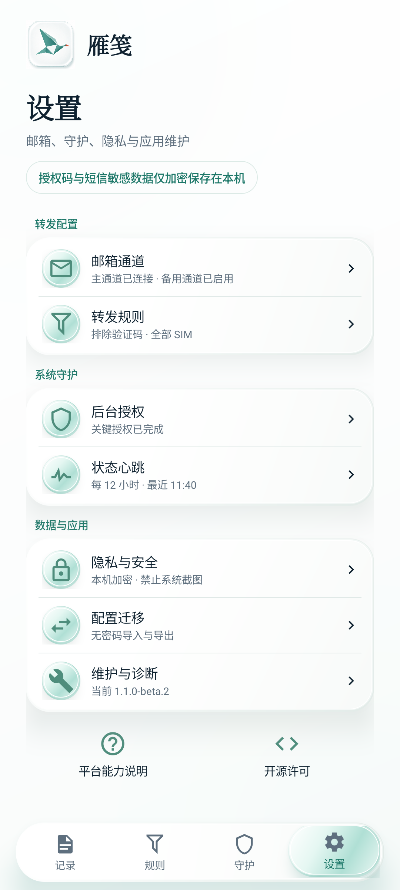
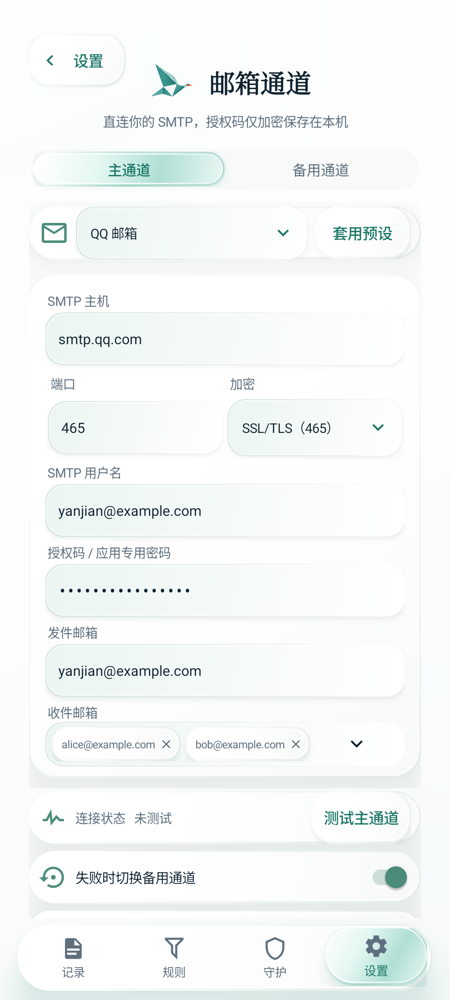
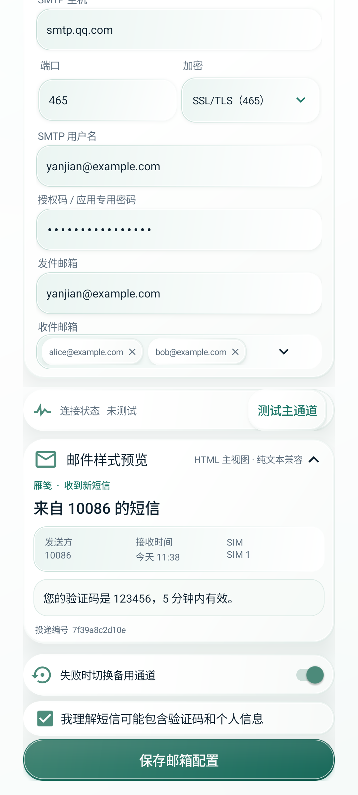

# v1.1.0 product design audit

Audit date: 2026-08-25

Target: Android 15 / API 35, 1080 × 2400, 420 dpi

Build: `1.1.0` (`versionCode 12`)

Data: synthetic only

## Outcome

The release-blocking UX findings are resolved. Settings now has a visible information architecture, nested pages have one clear parent, the open-source agreement is reachable and complete, and the outgoing email has a readable mobile layout with a plain-text fallback. No unresolved visual or interaction blocker was found in the audited flows.

## Current-run visual evidence

| Before | After |
| --- | --- |
|  |  |
|  |  |
|  |  |

## Audit steps

1. **Source and context capture — Healthy.** Audited the current Android implementation, the agreed month-white/jade design language and current-run screenshots; no replacement visual system was introduced.
2. **Settings information architecture — Resolved.** Re-grouped entries into forwarding, system guardian, data/privacy and application; added a dedicated About page.
3. **Return and menu hierarchy — Resolved.** Nested pages hide the root navigation, all visible back controls name their parent, and the Android back key/gesture returns License → About → Settings.
4. **Open-source placement — Resolved.** Added project Apache-2.0, NOTICE, third-party notices and an offline in-app license page with a collapsible full agreement.
5. **Forwarded email comprehension — Resolved.** Added distinct message-kind subjects, HTML and plain-text MIME alternatives, structured metadata, safe HTML escaping and a visible in-app preview.
6. **Visual consistency — Healthy.** Back controls, rows, cards, icons, spacing, colors and disclosure patterns use the existing component vocabulary; no duplicate root navigation remains on child pages.
7. **Accessibility and motion — Healthy within emulator scope.** All clickable nodes sampled on Settings are at least 140 px high at 420 dpi (above the 48 dp / 126 px target); 130% font scale remains readable; reduced-motion mode preserves navigation and content.
8. **Platform validation — Constrained, not blocked.** API 35 layout, routing and standard system behavior are verified. Virtual devices cannot validate real SIM reception, real SMTP delivery, vendor-specific background pages, animation feel on physical hardware or multi-day lock-screen reliability.

## Verification evidence

- 39 JVM unit tests passed, including destination-parent mapping, email escaping/subject tests and MIME multipart structure.
- Android Lint, Debug APK and Release APK builds passed.
- Nested page bottom navigation count: `0`; Settings root bottom navigation count: `1`.
- System back sequence: Open-source license → About Yanjian → Settings.
- Minimum sampled clickable bounds on Settings: `242 × 140 px` at 420 dpi.
- 130% font-scale screenshot: [a11y-font-130-about.png](a11y-font-130-about.png).

The screenshots are debug-build verification assets because distributable release builds intentionally set `FLAG_SECURE` to protect SMS and SMTP content. All visible values are synthetic; visual acceptance and long-duration behavior still require a physical supported device.
